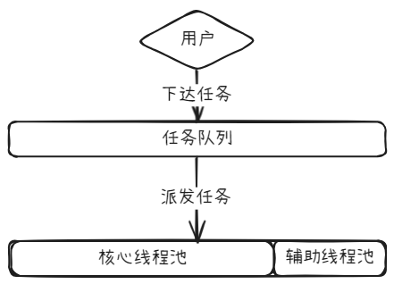

# 手写线程池
## 思考
### 简单梳理流程

## QUIZ
### 1. 你能给线程池增加一个shutdown功能吗？
### 2. 面试官问你：你怎么理解拒绝策略？如何回答？
### 3. JDK的线程池还有一个 ThreadFactory参数， 它是干嘛的？

## issue
### 1. 
```java
if (blockingQueue.offer(command)) {
    return;
}
```
这里如果任务成功放入队列，方法就直接 return 了。  
但在 创建 SupportThread 的逻辑中，没有保证这个任务会被执行，因为：  
offer() 失败后你才创建新线程。  
但 command 并没有交给这个新线程，而是再次尝试 offer()，如果失败就直接走拒绝策略了。  
这样的话，可能 SupportThread 已经启动，但任务却没被执行。  
> ❗修正方案：  
> 如果 blockingQueue 满了，并且仍然可以创建新线程，就应该让新线程直接执行这个任务。  